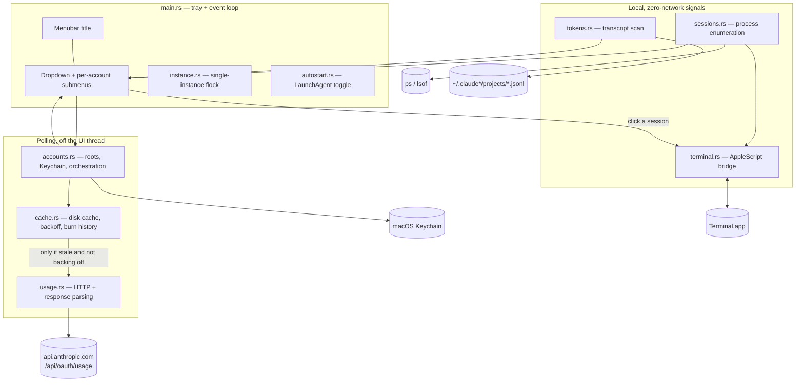

# Architecture

A single-binary macOS menubar app. No server, no database, no background daemon
beyond the app itself — all state is a handful of JSON files under
`~/.config/claude-usage/`.

## System Diagram

## Component Descriptions

### Tray and menu
- **Purpose**: Render the headline meter and the dropdown; own the event loop.
- **Location**: `src/main.rs`
- **Key responsibilities**: Build the menubar string, build the menu (including a
  submenu per account), map session menu-item ids to ttys, dispatch clicks. The
  id→tty map is rebuilt with the menu on every refresh, because menu ids are
  reissued each time and a stale map would raise the wrong session.

### Account polling
- **Purpose**: Turn a config root into a usage reading.
- **Location**: `src/accounts.rs`
- **Key responsibilities**: Resolve the Keychain service name from the root's
  absolute path, check the cache and backoff state before spending a request,
  check token expiry before spending one, and classify every failure as a named
  state rather than an error string.

### Usage client
- **Purpose**: The single network call.
- **Location**: `src/usage.rs`
- **Key responsibilities**: `GET /api/oauth/usage`, parse two different response
  shapes, collapse duplicate windows, and decide which windows are worth showing.

### Cache
- **Purpose**: Make repeat reads free and make a rate-limit response recoverable.
- **Location**: `src/cache.rs`
- **Key responsibilities**: Per-account freshness floor, exponential backoff with
  `Retry-After`, last-good values for stale-serving, and a bounded quota history
  used to compute a burn rate.

### Local signal collectors
- **Purpose**: Everything the app knows without touching the network.
- **Location**: `src/sessions.rs`, `src/terminal.rs`, `src/tokens.rs`
- **Key responsibilities**: Enumerate running sessions and attribute them to
  accounts; read and raise Terminal tabs over AppleScript; sum token usage from
  session transcripts inside a time window.

## Data Flow

1. A 300-second timer fires on a background thread — the UI thread never blocks
   on a network call.
2. Sessions are enumerated once for the whole batch: one `ps` call for pids, ttys
   and environment, one `lsof` call for every working directory, and one
   AppleScript call for every Terminal tab title.
3. For each configured account: if the cached reading is inside the freshness
   floor, or the account is in backoff, it is served from disk and no request is
   spent.
4. Otherwise the access token is read from the Keychain, its expiry is checked,
   and the usage endpoint is called.
5. The result updates the cache, appends to the burn-rate history, and may fire a
   notification if the account has transitioned from walled to available.
6. Token totals are summed from transcripts modified inside the window.
7. The menu and menubar title are rebuilt from the assembled statuses.

## External Integrations

| Service | Purpose | Notes |
|---|---|---|
| macOS Keychain | OAuth access tokens, one entry per config root | Read via the `security` CLI. Never written. |
| `api.anthropic.com/api/oauth/usage` | Per-window quota utilisation | Bearer token, `anthropic-beta: oauth-2025-04-20`. Rate-limited independently of quota. |
| Terminal.app | Read tab titles, raise a tab | AppleScript. Requires macOS Automation permission. |
| `ps` / `lsof` | Session enumeration, working directories | Batched to one invocation each per refresh. |
| launchd | Start at login | User LaunchAgent, written by the app. |

## Key Architectural Decisions

### Read-only credentials — never refresh a token
- **Context**: The stored credential blob contains a refresh token, and expired
  access tokens are common. The obvious behaviour is to refresh transparently.
- **Decision**: Never write to the Keychain and never perform a refresh. An
  expired token is reported as a *state* with a fix ("open this account once").
- **Rationale**: Refresh tokens rotate. Spending one without persisting the new
  pair would invalidate the credential its owner holds — a status display would
  silently sign you out of the account it is reporting on. Writing the new pair
  back instead means racing another process for its own credential store. Neither
  risk is worth taking for a meter.

### A freshness floor shared by every caller, not a per-call timer
- **Context**: The usage endpoint rate-limits on request frequency, entirely
  separately from quota consumption. The first version polled every 60 seconds
  per account and returned 429s while sitting near 0% utilisation.
- **Decision**: A 300-second refresh, plus a 120-second floor enforced inside
  `poll()` so the tray timer, both headless CLI modes and the Refresh button all
  draw from one budget. A 429 sets an exponential backoff that honours
  `Retry-After`, and the last good reading keeps being displayed.
- **Rationale**: The original 60 was copied from a related tool where it is a
  *floor on event-driven polls*, not a timer — that tool only fetches when an
  event fires. Copying the number turned a floor into a sustained 60 requests per
  hour per account. Crucially, the Refresh button bypasses the freshness floor
  but **not** the backoff: letting a button push through a backoff is how one
  rate-limit response becomes a sustained one.

### Cache keyed by root path, never by label
- **Context**: Accounts are configured in a user-editable JSON file with a
  display label and a path. Keying cache files by label is the obvious choice.
- **Decision**: Cache filenames are `sha256(absolute_path)[..8]` — the same
  identity the Keychain service name uses.
- **Rationale**: Labels are mutable. Reordering or renaming entries silently
  re-points a cache file at a different account, and the cache holds more than a
  percentage: a "walled → available" notification would fire for the wrong
  account, and a burn rate would be computed from two accounts' samples spliced
  together. The path is already the account's identity — a second config root
  *is* a second account — so it is the only stable key.

### tty as the join key between a process and its window
- **Context**: To list sessions with meaningful names and raise the right window,
  each running process must be matched to a human-readable title.
- **Decision**: Join on tty. `ps -o tty=` gives a tty per pid; Terminal exposes
  `custom title` per tab keyed by tty, and that title is already the session name.
- **Rationale**: The direct routes fail. `lsof` shows no open transcript, because
  transcripts are appended and closed rather than held open. Falling back to
  "newest transcript in the project folder" breaks exactly where it matters,
  since several sessions can share one working directory with no way to tell
  which process owns which file. tty is exact and needs no heuristics.

### Deduplicate response windows by identity, not by value
- **Context**: The API reports some limits twice — once as a top-level object and
  again inside a `limits[]` array — producing duplicate rows.
- **Decision**: An explicit alias map (`session → five_hour`,
  `weekly_all → seven_day`). Anything not in the map is shown.
- **Rationale**: The tempting rule is "merge rows with the same value and reset
  time". Two genuinely unrelated limits currently share a value (both zero) and
  would be merged today, then split apart the moment one becomes non-zero —
  producing rows that appear and vanish between refreshes. Unknown keys fail
  *visible* rather than hidden, so a limit the API starts returning surfaces
  instead of being silently dropped.

### An allow-list of meaningful windows, not a deny-list of noisy ones
- **Context**: The response carries several undocumented keys that have always
  read zero, alongside per-model caps that are usually zero. Showing them all
  makes seven rows per account where two matter.
- **Decision**: Two core windows always render even at 0%. Every other window is
  hidden while zero and appears automatically if it ever carries a value.
- **Rationale**: The rule is not "hide zeros" — it is "hide zeros that say
  nothing". `0%` on a core window means full headroom, which is exactly what the
  reader opened the menu to learn. An allow-list of two also beats a deny-list of
  six: an undocumented key that has never been seen behaves correctly without
  being enumerated first.
