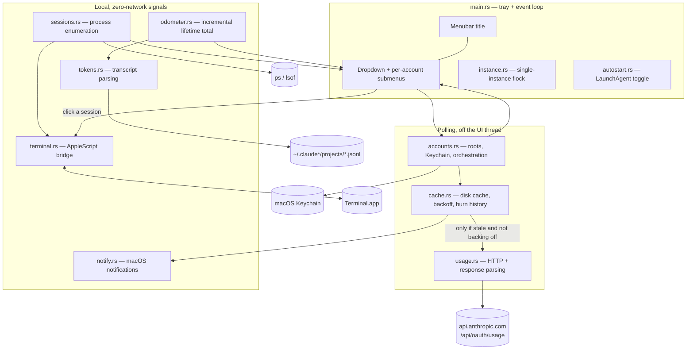

# Architecture

A single-binary macOS menubar app. No server, no database, no background daemon
beyond the app itself — all state is a handful of JSON files under
`~/.config/claude-gauge/`.

## System Diagram

## Component Descriptions

### Tray and menu
- **Purpose**: Render the headline meter and the dropdown; own the event loop.
- **Location**: `src/main.rs`
- **Key responsibilities**: Build the menubar string, build the menu (including a
  submenu per account), map session menu-item ids to ttys, dispatch clicks.
- **Update path**: Content is computed into a `Rendered` value *before* any menu
  object is touched, so a refresh can do the least it can — nothing if the
  content is identical, `set_text` on the existing items if only the strings
  changed, and a full rebuild only when items must be added or removed. macOS
  closes an open menu when its `NSMenu` is replaced, so this is what keeps a
  submenu open while you are hovering it.
- The id→tty map is rewritten on every update, not just on rebuild. A session
  can end as another starts, leaving the count unchanged while a position now
  holds a different session — assuming the mapping is stable would raise the
  wrong window.

### Account polling
- **Purpose**: Turn a config root into a usage reading.
- **Location**: `src/accounts.rs`
- **Key responsibilities**: Resolve the Keychain service name from the root's
  absolute path, check the cache and backoff state before spending a request,
  check token expiry before spending one, and classify every failure as a named
  state rather than an error string.

### Usage client
- **Purpose**: The single network call.
- **Location**: `src/usage.rs`
- **Key responsibilities**: `GET /api/oauth/usage`, parse two different response
  shapes, collapse duplicate windows, and decide which windows are worth showing.

### Cache
- **Purpose**: Make repeat reads free and make a rate-limit response recoverable.
- **Location**: `src/cache.rs`
- **Key responsibilities**: Per-account freshness floor, exponential backoff with
  `Retry-After`, last-good values for stale-serving, and a bounded quota history
  used to compute a burn rate.

### Local signal collectors
- **Purpose**: Everything the app knows without touching the network.
- **Location**: `src/sessions.rs`, `src/terminal.rs`, `src/tokens.rs`
- **Key responsibilities**: Enumerate running sessions and attribute them to
  accounts; read and raise Terminal tabs over AppleScript; walk transcripts
  recursively and parse their per-message usage blocks.

### Odometer
- **Purpose**: A lifetime total of every token ever processed, across all accounts.
- **Location**: `src/odometer.rs`
- **Key responsibilities**: Track a byte offset per transcript so each pass reads
  only newly appended data, stop at the last complete line, and persist totals
  that never decrease.

### Notifications
- **Purpose**: Tell you when a walled account becomes usable again.
- **Location**: `src/notify.rs`
- **Key responsibilities**: Post via `osascript`, passing text through `on run
  argv` rather than interpolating it into the script — a value containing a quote
  must not be able to change what the script does.

## Data Flow

1. Two independent timers run on their own threads, so the UI thread never blocks
   on a network call: sessions every 60 seconds, quota every 300. Session data
   costs no requests, so it is not held to the request budget.
2. A session pass is three calls totalling ~147ms: one `ps` for pids, ttys and
   environment, one `lsof` for every working directory, and one AppleScript that
   fetches every tab's tty and title in **two bulk property reads** rather than a
   round-trip per property.
3. For each configured account: if the cached reading is inside the freshness
   floor, or the account is in backoff, it is served from disk and no request is
   spent.
4. Otherwise the access token is read from the Keychain, its expiry is checked,
   and the usage endpoint is called.
5. The result updates the cache, appends to the burn-rate history, and may fire a
   notification if the account has transitioned from walled to available.
6. The odometer folds any newly appended transcript bytes into its running
   totals. Its first pass reads the whole corpus and runs on its own thread, so
   the menubar is never held up by it.
7. The menu and menubar title are rebuilt from the assembled statuses.

## External Integrations

| Service | Purpose | Notes |
|---|---|---|
| macOS Keychain | OAuth access tokens, one entry per config root | Read via the `security` CLI. Never written. |
| `api.anthropic.com/api/oauth/usage` | Per-window quota utilisation | Bearer token, `anthropic-beta: oauth-2025-04-20`. Rate-limited independently of quota. |
| Terminal.app | Read tab titles, raise a tab | AppleScript. Requires macOS Automation permission. |
| `ps` / `lsof` | Session enumeration, working directories | Batched to one invocation each per refresh. |
| launchd | Start at login | User LaunchAgent, written by the app. |

## Key Architectural Decisions

### Read-only credentials — never refresh a token
- **Context**: The stored credential blob contains a refresh token, and expired
  access tokens are common. The obvious behaviour is to refresh transparently.
- **Decision**: Never write to the Keychain and never perform a refresh. An
  expired token falls back to the last cached reading rather than an error.
- **Rationale**: Refresh tokens rotate. Spending one without persisting the new
  pair would invalidate the credential its owner holds — a status display would
  silently sign you out of the account it is reporting on. Writing the new pair
  back instead means racing another process for its own credential store. Neither
  risk is worth taking for a meter. Delegating the refresh to a CLI subprocess is
  a dead end as well: a shipped implementation of that times out, because the CLI
  starts in REPL mode, and the attempt can launch a browser.

  Expiry is then handled by showing the last reading. Tokens live about eight
  hours and the CLI only refreshes its own while running, so the accounts that
  expire are exactly the ones not in use — which are the ones the meter exists to
  evaluate. A stale reading is conservative there, since an idle account only
  recovers quota, except once its reset has passed: that window has refilled, so
  it reads 0%.

### A freshness floor shared by every caller, not a per-call timer
- **Context**: The usage endpoint rate-limits on request frequency, entirely
  separately from quota consumption. The first version polled every 60 seconds
  per account and returned 429s while sitting near 0% utilisation.
- **Decision**: A 300-second refresh, plus a 120-second floor enforced inside
  `poll()` so the tray timer, both headless CLI modes and the Refresh button all
  draw from one budget. A 429 sets an exponential backoff that honours
  `Retry-After`, and the last good reading keeps being displayed.
- **Rationale**: The original 60 was copied from a related tool where it is a
  *floor on event-driven polls*, not a timer — that tool only fetches when an
  event fires. Copying the number turned a floor into a sustained 60 requests per
  hour per account. Crucially, the Refresh button bypasses the freshness floor
  but **not** the backoff: letting a button push through a backoff is how one
  rate-limit response becomes a sustained one.

### Cache keyed by root path, never by label
- **Context**: Accounts are configured in a user-editable JSON file with a
  display label and a path. Keying cache files by label is the obvious choice.
- **Decision**: Cache filenames are `sha256(absolute_path)[..8]` — the same
  identity the Keychain service name uses.
- **Rationale**: Labels are mutable. Reordering or renaming entries silently
  re-points a cache file at a different account, and the cache holds more than a
  percentage: a "walled → available" notification would fire for the wrong
  account, and a burn rate would be computed from two accounts' samples spliced
  together. The path is already the account's identity — a second config root
  *is* a second account — so it is the only stable key.

### tty as the join key between a process and its window
- **Context**: To list sessions with meaningful names and raise the right window,
  each running process must be matched to a human-readable title.
- **Decision**: Join on tty. `ps -o tty=` gives a tty per pid; Terminal exposes
  `custom title` per tab keyed by tty, and that title is already the session name.
- **Rationale**: The direct routes fail. `lsof` shows no open transcript, because
  transcripts are appended and closed rather than held open. Falling back to
  "newest transcript in the project folder" breaks exactly where it matters,
  since several sessions can share one working directory with no way to tell
  which process owns which file. tty is exact and needs no heuristics.

### Picking the right window for each job
- **Context**: The response carries several quota windows per account, reported
  inconsistently: some appear twice under different names, several undocumented
  keys have always read zero, and per-model caps are usually zero. Two separate
  questions have to be answered from that set — which windows to *show*, and
  which window a burn *rate* should be measured on.
- **Decision**: For display, collapse duplicates through an explicit alias map,
  keep two core windows always visible, and hide every other window at 0% until
  it carries a value. For the rate, sample the five-hour window specifically —
  not the worst one — and withhold the exhaustion projection when the window
  resets before it.
- **Rationale**: Both obvious answers are wrong in the same way — they use a
  property that happens to correlate rather than the one that means something.
  Deduplicating on *value* would merge two unrelated limits that both read zero
  today and split them apart the moment one moved, so rows would appear and
  vanish between refreshes; identity is stable, value is not. Rating the *worst*
  window fails on exactly the account that matters, because a weekly pinned at
  100% is flat only by virtue of being at the ceiling, hiding a five-hour that is
  climbing. And a projection past the reset describes a wall the reset cancels.
  Visibility follows the same test: the rule is not "hide zeros" but "hide zeros
  that say nothing", since 0% on a core window means full headroom — the thing
  the reader opened the menu to learn.

### An incremental odometer rather than a repeated full scan
- **Context**: A lifetime token total needs every transcript ever written —
  currently ~8,400 files and over a gigabyte, and growing forever.
- **Decision**: Persist a byte offset per file and read only what is new, counting
  through the last complete line. Deleted transcripts keep their contribution.
- **Rationale**: Rescanning everything each refresh is affordable today (a few
  seconds) but grows without bound and would burn that cost every five minutes
  forever. Transcripts are append-only, so offsets are sound. Two details are
  load-bearing: stopping at the last newline, because a file being written can end
  mid-line and advancing past it would drop those tokens permanently rather than
  picking them up next pass; and never subtracting for a deleted file, because an
  odometer measures what was spent, not what still exists.

